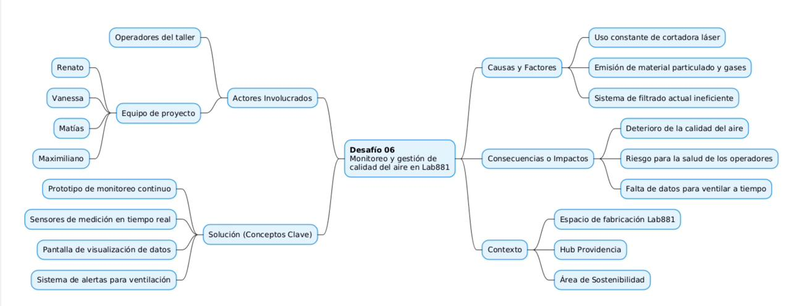
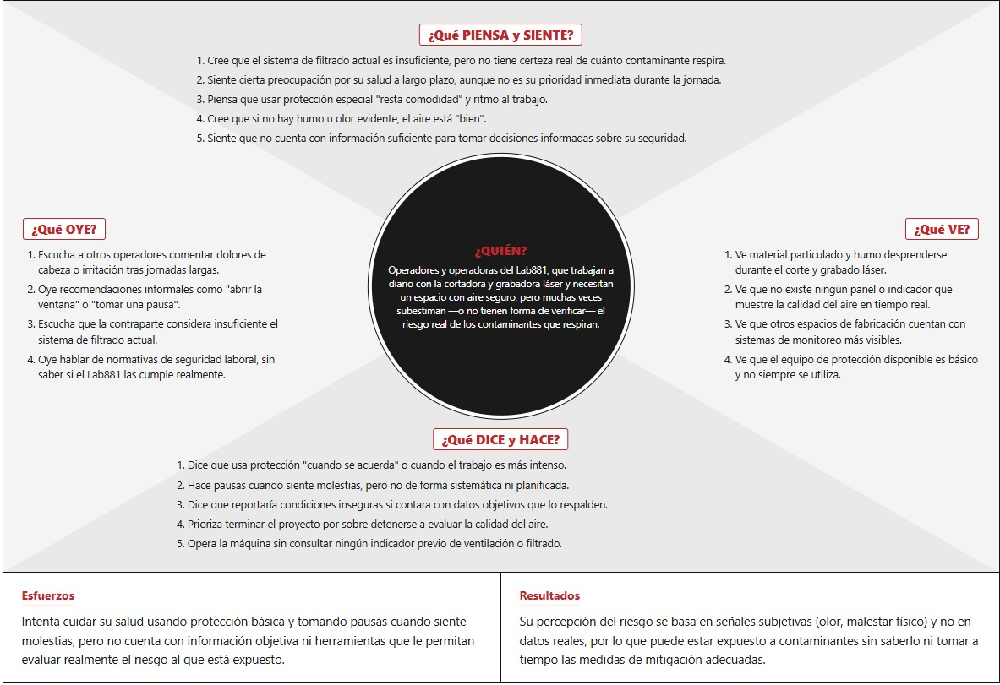

# Bitácora Semana 2 - Equipo SMAIRT

Bienvenido a la bitácora de la segunda semana del proyecto sobre la telemetría de sensores para calidad del aire, correspondiente al Desafío 06: Monitoreo y gestión de calidad del aire en Lab881. A continuación, presentamos nuestra **Ficha de Desafío**, el documento que consolida toda la información que hemos reunido para entender a profundidad el contexto y los usuarios antes de desarrollar nuestro prototipo.

## Ficha de Desafío 06

### 1. Definición del Desafío y Contexto (Pitch)
Se aborda una problemática crítica de Sostenibilidad en el espacio de fabricación Lab881 del Hub Providencia. Actualmente, el uso de la máquina de corte y grabado láser genera material particulado y gases contaminantes que no logran ser contenidos por un sistema de filtrado ineficiente.

El objetivo es diseñar un prototipo de monitoreo continuo que integre sensores, pantallas y un sistema de alertas para entregar datos objetivos y en tiempo real. Nuestro desafío es visibilizar este "enemigo invisible" para orientar eficientemente las medidas de ventilación y proteger la salud humana.

### 2. Ecosistema del Proyecto (Mapa Conceptual)
Este esquema visualiza las relaciones entre la máquina láser, el deterioro del aire y nuestra solución.

* **Causas Principales:** El uso constante de la cortadora láser genera emisiones de gases y material particulado que superan la capacidad del sistema de filtrado actual.
* **Consecuencias Directas:** Existe un deterioro constante de la calidad del aire, lo que representa un riesgo inminente para la salud de los operadores al no contar con datos objetivos para ventilar a tiempo.
* **Pilares de la Solución:** La intervención se basa en un prototipo estructurado en tres partes: sensores de medición en tiempo real, pantalla de visualización de datos y sistema de alertas para activar la ventilación.

### 3. Perfil del Usuario: Operadores de Lab881 (Mapa de Empatía)
La solución está centrada en las operadoras y operadores que trabajan a diario con la cortadora y que muchas veces subestiman o no pueden verificar el riesgo real del aire.

* **¿Qué piensa y siente?** Siente preocupación por su salud a largo plazo, pero no es su prioridad inmediata. Existe una falsa sensación de seguridad al creer que si no hay humo u olor evidente, el aire está "bien". Siente que no cuenta con información suficiente para tomar decisiones.
* **¿Qué ve?** Material particulado y humo durante los cortes. Nota la ausencia total de paneles indicadores de la calidad del aire y observa que el equipo de protección disponible es básico y no siempre se usa.
* **¿Qué oye?** Quejas de otros operadores sobre dolores de cabeza e irritación. Escucha recomendaciones informales ineficientes (como "abrir la ventana") y sabe que la contraparte también considera ineficiente el filtro actual.
* **¿Qué dice y hace?** Usa protección o hace pausas solo "cuando se acuerda" o siente molestias. Prioriza terminar el proyecto sobre detenerse a evaluar el aire. Sin embargo, afirma que reportaría condiciones inseguras si contara con datos objetivos que lo respaldaran.
* **Esfuerzos (Frustraciones):** Intenta cuidar su salud tomando medidas reactivas, pero choca con la falta absoluta de herramientas e información objetiva para evaluar el verdadero riesgo al que está expuesto.
* **Resultados (Necesidades):** Su percepción de riesgo se basa en la subjetividad. Necesita transformar esas intuiciones en datos reales (pantallas y alertas) para poder tomar medidas de mitigación adecuadas y a tiempo.

### 4. Validación: Certezas e Incógnitas
Antes de pasar a la fase de diseño del prototipo, definimos lo que ya tenemos validado y la información técnica que necesitamos investigar para avanzar:

**Lo que sabemos (Certezas):**
* El problema ocurre en el espacio de fabricación Lab881 o Hub Providencia.
* La fuente principal de contaminación es la cortadora láser (emite material particulado y gases) y su filtro actual no da abasto.
* La mitigación "a ciegas" no funciona; la solución requiere obligatoriamente medir con sensores y emitir alertas visuales o sonoras para gestionar la ventilación de manera oportuna.

**Lo que necesitamos saber (Preguntas Clave):**
* ¿Qué opciones técnicas viables de sensores existen para medir específicamente el material particulado y los compuestos orgánicos volátiles (VOCs)?
* ¿Cuáles son los límites permisibles exactos según la normativa chilena de calidad del aire para poder establecer los umbrales de las alertas?
* ¿Cómo será la arquitectura del sistema y de qué forma se comunicarán los sensores con la pantalla de visualización en tiempo real?
* ¿Cómo será el diagrama de flujo y la lógica para que el sistema emita las alertas visuales y sonoras oportunamente?
